# [📈 Live Status](https://targed.github.io/Awesome-Plugins/): <!--live status--> **🟧 Partial outage**

More information and descriptions about each plugin can be found [**here**](https://github.com/targed/Awesome-Plugins/blob/main/PLUGIN-INFORMATION.md)

Submit a plugin you find to this list [**here**](https://forms.gle/Qty5HowCwE61c5pb7)

This repository contains the open-source uptime monitor and status page for [targed](https://targed.github.io/Awesome-Plugins/), powered by [Upptime](https://github.com/upptime/upptime).

With [Upptime](https://upptime.js.org), you can get your own unlimited and free uptime monitor and status page, powered entirely by a GitHub repository. We use [Issues](https://github.com/targed/Awesome-Plugins/issues) as incident reports, [Actions](https://github.com/targed/Awesome-Plugins/actions) as uptime monitors, and [Pages](https://demo.upptime.js.org) for the status page.

<!--start: status pages-->
<!-- This summary is generated by Upptime (https://github.com/upptime/upptime) -->
<!-- Do not edit this manually, your changes will be overwritten -->
<!-- prettier-ignore -->
| URL | Status | History | Response Time | Uptime |
| --- | ------ | ------- | ------------- | ------ |
|  [Academic_research_engine](https://oa.mg/.well-known/ai-plugin.json) | 🟥 Down | [academic-research-engine.yml](https://github.com/targed/Awesome-Plugins/commits/HEAD/history/academic-research-engine.yml) | 

 794ms
     
 | 

<a href="https://targed.github.io/Awesome-Plugins/history/academic-research-engine">100.00%</a>
    

|  [Agones](https://agones.gr/.well-known/ai-plugin.json) | 🟩 Up | [agones.yml](https://github.com/targed/Awesome-Plugins/commits/HEAD/history/agones.yml) | 

 1204ms
     
 | 

<a href="https://targed.github.io/Awesome-Plugins/history/agones">0.00%</a>
    

|  [Aitoolhunt](https://www.aitoolhunt.com/.well-known/ai-plugin.json) | 🟩 Up | [aitoolhunt.yml](https://github.com/targed/Awesome-Plugins/commits/HEAD/history/aitoolhunt.yml) | 

 221ms
     
 | 

<a href="https://targed.github.io/Awesome-Plugins/history/aitoolhunt">0.00%</a>
    

|  [Algorithma](https://algorithma.ruvnet.repl.co/.well-known/ai-plugin.json) | 🟥 Down | [algorithma.yml](https://github.com/targed/Awesome-Plugins/commits/HEAD/history/algorithma.yml) | 

 0ms
     
 | 

<a href="https://targed.github.io/Awesome-Plugins/history/algorithma">100.00%</a>
    

|  [Alphavantage](https://www.alphavantage.co/.well-known/ai-plugin.json) | 🟩 Up | [alphavantage.yml](https://github.com/targed/Awesome-Plugins/commits/HEAD/history/alphavantage.yml) | 

 172ms
     
 | 

<a href="https://targed.github.io/Awesome-Plugins/history/alphavantage">0.00%</a>
    

|  [Amazingtalker](https://en.amazingtalker.com/.well-known/ai-plugin.json) | 🟩 Up | [amazingtalker.yml](https://github.com/targed/Awesome-Plugins/commits/HEAD/history/amazingtalker.yml) | 

 552ms
     
 | 

<a href="https://targed.github.io/Awesome-Plugins/history/amazingtalker">100.00%</a>
    

|  [APIs.guru](https://apis.guru/.well-known/ai-plugin.json) | 🟩 Up | [ap-is-guru.yml](https://github.com/targed/Awesome-Plugins/commits/HEAD/history/ap-is-guru.yml) | 

 422ms
     
 | 

<a href="https://targed.github.io/Awesome-Plugins/history/ap-is-guru">100.00%</a>
    

|  [Appypie](https://www.appypie.com/.well-known/ai-plugin.json) | 🟥 Down | [appypie.yml](https://github.com/targed/Awesome-Plugins/commits/HEAD/history/appypie.yml) | 

 1344ms
     
 | 

<a href="https://targed.github.io/Awesome-Plugins/history/appypie">0.00%</a>
    

|  [Asana](https://app.asana.com/.well-known/ai-plugin.json) | 🟩 Up | [asana.yml](https://github.com/targed/Awesome-Plugins/commits/HEAD/history/asana.yml) | 

 139ms
     
 | 

<a href="https://targed.github.io/Awesome-Plugins/history/asana">0.00%</a>
    

|  [ASCIIArt](https://chatgpt-plugin-ts.transitive-bullshit.workers.dev/.well-known/ai-plugin.json) | 🟩 Up | [ascii-art.yml](https://github.com/targed/Awesome-Plugins/commits/HEAD/history/ascii-art.yml) | 

 186ms
     
 | 

<a href="https://targed.github.io/Awesome-Plugins/history/ascii-art">100.00%</a>
    

|  [Babyagichatgpt](https://babyagichatgpt.skirano.repl.co/.well-known/ai-plugin.json) | 🟥 Down | [babyagichatgpt.yml](https://github.com/targed/Awesome-Plugins/commits/HEAD/history/babyagichatgpt.yml) | 

 0ms
     
 | 

<a href="https://targed.github.io/Awesome-Plugins/history/babyagichatgpt">100.00%</a>
    

|  [Binance](https://public.bnbstatic.com/.well-known/ai-plugin.json) | 🟩 Up | [binance.yml](https://github.com/targed/Awesome-Plugins/commits/HEAD/history/binance.yml) | 

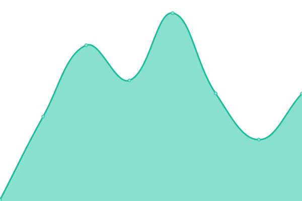 117ms
     
 | 

<a href="https://targed.github.io/Awesome-Plugins/history/binance">100.00%</a>
    

|  [Biztoc](https://biztoc.com/.well-known/ai-plugin.json) | 🟩 Up | [biztoc.yml](https://github.com/targed/Awesome-Plugins/commits/HEAD/history/biztoc.yml) | 

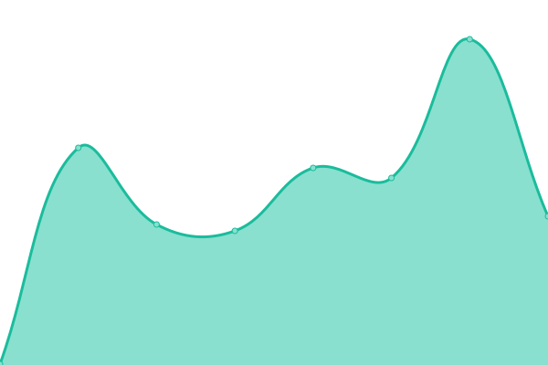 278ms
     
 | 

<a href="https://targed.github.io/Awesome-Plugins/history/biztoc">0.00%</a>
    

|  [Boxil](https://boxil.jp/.well-known/ai-plugin.json) | 🟥 Down | [boxil.yml](https://github.com/targed/Awesome-Plugins/commits/HEAD/history/boxil.yml) | 

 959ms
     
 | 

<a href="https://targed.github.io/Awesome-Plugins/history/boxil">0.00%</a>
    

|  [Boxon](https://www.boxon.com/.well-known/ai-plugin.json) | 🟩 Up | [boxon.yml](https://github.com/targed/Awesome-Plugins/commits/HEAD/history/boxon.yml) | 

 488ms
     
 | 

<a href="https://targed.github.io/Awesome-Plugins/history/boxon">0.00%</a>
    

|  [Brainlox](https://brainlox.ai/.well-known/ai-plugin.json) | 🟩 Up | [brainlox.yml](https://github.com/targed/Awesome-Plugins/commits/HEAD/history/brainlox.yml) | 

 220ms
     
 | 

<a href="https://targed.github.io/Awesome-Plugins/history/brainlox">100.00%</a>
    

|  [Broadway](https://www.broadway.com/.well-known/ai-plugin.json) | 🟩 Up | [broadway.yml](https://github.com/targed/Awesome-Plugins/commits/HEAD/history/broadway.yml) | 

 131ms
     
 | 

<a href="https://targed.github.io/Awesome-Plugins/history/broadway">100.00%</a>
    

|  [Bundlejs](https://deno.bundlejs.com/.well-known/ai-plugin.json) | 🟩 Up | [bundlejs.yml](https://github.com/targed/Awesome-Plugins/commits/HEAD/history/bundlejs.yml) | 

 387ms
     
 | 

<a href="https://targed.github.io/Awesome-Plugins/history/bundlejs">0.00%</a>
    

|  [Cactiml](https://labs.cactiml.com/.well-known/ai-plugin.json) | 🟥 Down | [cactiml.yml](https://github.com/targed/Awesome-Plugins/commits/HEAD/history/cactiml.yml) | 

 238ms
     
 | 

<a href="https://targed.github.io/Awesome-Plugins/history/cactiml">100.00%</a>
    

|  [Chatmaps](https://chatmaps.sdan.io/.well-known/ai-plugin.json) | 🟥 Down | [chatmaps.yml](https://github.com/targed/Awesome-Plugins/commits/HEAD/history/chatmaps.yml) | 

 450ms
     
 | 

<a href="https://targed.github.io/Awesome-Plugins/history/chatmaps">100.00%</a>
    

|  [Chatspot](https://chatspot.ai/.well-known/ai-plugin.json) | 🟩 Up | [chatspot.yml](https://github.com/targed/Awesome-Plugins/commits/HEAD/history/chatspot.yml) | 

 246ms
     
 | 

<a href="https://targed.github.io/Awesome-Plugins/history/chatspot">100.00%</a>
    

|  [Chatwithwebsite](https://chatwithwebsite.sdan.io/.well-known/ai-plugin.json) | 🟥 Down | [chatwithwebsite.yml](https://github.com/targed/Awesome-Plugins/commits/HEAD/history/chatwithwebsite.yml) | 

 561ms
     
 | 

<a href="https://targed.github.io/Awesome-Plugins/history/chatwithwebsite">100.00%</a>
    

|  [Calculator](https://chat-calculator-plugin.supportmirage.repl.co/.well-known/ai-plugin.json) | 🟥 Down | [calculator.yml](https://github.com/targed/Awesome-Plugins/commits/HEAD/history/calculator.yml) | 

 0ms
     
 | 

<a href="https://targed.github.io/Awesome-Plugins/history/calculator">100.00%</a>
    

|  [Capcut](https://www.capcut.com/.well-known/ai-plugin.json) | 🟩 Up | [capcut.yml](https://github.com/targed/Awesome-Plugins/commits/HEAD/history/capcut.yml) | 

 493ms
     
 | 

<a href="https://targed.github.io/Awesome-Plugins/history/capcut">100.00%</a>
    

|  [Coderpad](https://app.coderpad.io/.well-known/ai-plugin.json) | 🟩 Up | [coderpad.yml](https://github.com/targed/Awesome-Plugins/commits/HEAD/history/coderpad.yml) | 

 345ms
     
 | 

<a href="https://targed.github.io/Awesome-Plugins/history/coderpad">100.00%</a>
    

|  [ConvertPDF](https://pheecws.foxit.com/.well-known/ai-plugin.json) | 🟩 Up | [convert-pdf.yml](https://github.com/targed/Awesome-Plugins/commits/HEAD/history/convert-pdf.yml) | 

 194ms
     
 | 

<a href="https://targed.github.io/Awesome-Plugins/history/convert-pdf">100.00%</a>
    

|  [Coupert](https://www.coupert.com/.well-known/ai-plugin.json) | 🟩 Up | [coupert.yml](https://github.com/targed/Awesome-Plugins/commits/HEAD/history/coupert.yml) | 

 205ms
     
 | 

<a href="https://targed.github.io/Awesome-Plugins/history/coupert">100.00%</a>
    

|  [Coursehero](https://www.coursehero.com/.well-known/ai-plugin.json) | 🟥 Down | [coursehero.yml](https://github.com/targed/Awesome-Plugins/commits/HEAD/history/coursehero.yml) | 

 1009ms
     
 | 

<a href="https://targed.github.io/Awesome-Plugins/history/coursehero">0.00%</a>
    

|  [Coursera](https://www.coursera.com/.well-known/ai-plugin.json) | 🟩 Up | [coursera.yml](https://github.com/targed/Awesome-Plugins/commits/HEAD/history/coursera.yml) | 

 935ms
     
 | 

<a href="https://targed.github.io/Awesome-Plugins/history/coursera">0.00%</a>
    

|  [Crane Pumps Manuals](https://www.cranepumps.com/.well-known/ai-plugin.json) | 🟥 Down | [crane-pumps-manuals.yml](https://github.com/targed/Awesome-Plugins/commits/HEAD/history/crane-pumps-manuals.yml) | 

 261ms
     
 | 

<a href="https://targed.github.io/Awesome-Plugins/history/crane-pumps-manuals">100.00%</a>
    

|  [Creaticode](https://openai.creaticode.com/.well-known/ai-plugin.json) | 🟥 Down | [creaticode.yml](https://github.com/targed/Awesome-Plugins/commits/HEAD/history/creaticode.yml) | 

 273ms
     
 | 

<a href="https://targed.github.io/Awesome-Plugins/history/creaticode">100.00%</a>
    

|  [Crossmint](https://www.crossmint.com/.well-known/ai-plugin.json) | 🟩 Up | [crossmint.yml](https://github.com/targed/Awesome-Plugins/commits/HEAD/history/crossmint.yml) | 

 355ms
     
 | 

<a href="https://targed.github.io/Awesome-Plugins/history/crossmint">0.00%</a>
    

|  [Cryptojobslist](https://cryptojobslist.com/.well-known/ai-plugin.json) | 🟥 Down | [cryptojobslist.yml](https://github.com/targed/Awesome-Plugins/commits/HEAD/history/cryptojobslist.yml) | 

 0ms
     
 | 

<a href="https://targed.github.io/Awesome-Plugins/history/cryptojobslist">100.00%</a>
    

|  [DALL-E](https://api.openai.com/.well-known/ai-plugin.json) | 🟥 Down | [dall-e.yml](https://github.com/targed/Awesome-Plugins/commits/HEAD/history/dall-e.yml) | 

 123ms
     
 | 

<a href="https://targed.github.io/Awesome-Plugins/history/dall-e">100.00%</a>
    

|  [Datamuse](https://datamuse.com/.well-known/ai-plugin.json) | 🟩 Up | [datamuse.yml](https://github.com/targed/Awesome-Plugins/commits/HEAD/history/datamuse.yml) | 

 202ms
     
 | 

<a href="https://targed.github.io/Awesome-Plugins/history/datamuse">0.00%</a>
    

|  [Datasette](https://datasette.io/.well-known/ai-plugin.json) | 🟩 Up | [datasette.yml](https://github.com/targed/Awesome-Plugins/commits/HEAD/history/datasette.yml) | 

 232ms
     
 | 

<a href="https://targed.github.io/Awesome-Plugins/history/datasette">0.00%</a>
    

|  [Decisionjournal](https://decisionjournalapp.com/.well-known/ai-plugin.json) | 🟩 Up | [decisionjournal.yml](https://github.com/targed/Awesome-Plugins/commits/HEAD/history/decisionjournal.yml) | 

 103ms
     
 | 

<a href="https://targed.github.io/Awesome-Plugins/history/decisionjournal">100.00%</a>
    

|  [Dev](https://dev.to/.well-known/ai-plugin.json) | 🟩 Up | [dev.yml](https://github.com/targed/Awesome-Plugins/commits/HEAD/history/dev.yml) | 

 164ms
     
 | 

<a href="https://targed.github.io/Awesome-Plugins/history/dev">100.00%</a>
    

|  [Dexa Lex Fridman](https://chatgpt-plugin-dexa-lex-fridman.transitive-bullshit.workers.dev/.well-known/ai-plugin.json) | 🟩 Up | [dexa-lex-fridman.yml](https://github.com/targed/Awesome-Plugins/commits/HEAD/history/dexa-lex-fridman.yml) | 

 141ms
     
 | 

<a href="https://targed.github.io/Awesome-Plugins/history/dexa-lex-fridman">100.00%</a>
    

|  [Docsbot](https://docsbot.ai/.well-known/ai-plugin.json) | 🟩 Up | [docsbot.yml](https://github.com/targed/Awesome-Plugins/commits/HEAD/history/docsbot.yml) | 

 227ms
     
 | 

<a href="https://targed.github.io/Awesome-Plugins/history/docsbot">0.00%</a>
    

|  [Doordash](https://consumer-mobile-bff.doordash.com/v1/aichat/static/ai-plugin.json) | 🟥 Down | [doordash.yml](https://github.com/targed/Awesome-Plugins/commits/HEAD/history/doordash.yml) | 

 210ms
     
 | 

<a href="https://targed.github.io/Awesome-Plugins/history/doordash">100.00%</a>
    

|  [Edmunds](https://api.edmunds.com/.well-known/ai-plugin.json) | 🟩 Up | [edmunds.yml](https://github.com/targed/Awesome-Plugins/commits/HEAD/history/edmunds.yml) | 

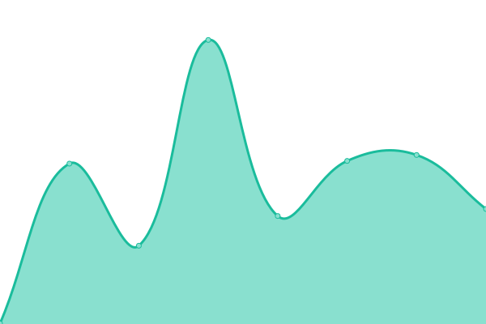 322ms
     
 | 

<a href="https://targed.github.io/Awesome-Plugins/history/edmunds">100.00%</a>
    

|  [Etoro](https://www.etoro.com/.well-known/ai-plugin.json) | 🟩 Up | [etoro.yml](https://github.com/targed/Awesome-Plugins/commits/HEAD/history/etoro.yml) | 

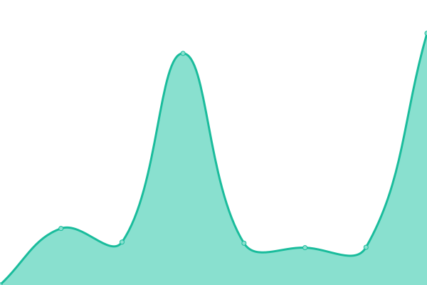 1140ms
     
 | 

<a href="https://targed.github.io/Awesome-Plugins/history/etoro">100.00%</a>
    

|  [Freetv](https://www.freetv-app.com/.well-known/ai-plugin.json) | 🟩 Up | [freetv.yml](https://github.com/targed/Awesome-Plugins/commits/HEAD/history/freetv.yml) | 

 104ms
     
 | 

<a href="https://targed.github.io/Awesome-Plugins/history/freetv">100.00%</a>
    

|  [Fyrebox](https://www.fyrebox.com/.well-known/ai-plugin.json) | 🟩 Up | [fyrebox.yml](https://github.com/targed/Awesome-Plugins/commits/HEAD/history/fyrebox.yml) | 

 323ms
     
 | 

<a href="https://targed.github.io/Awesome-Plugins/history/fyrebox">100.00%</a>
    

|  [Getit](https://api.getit.ai/.well_known/ai-plugin.json) | 🟥 Down | [getit.yml](https://github.com/targed/Awesome-Plugins/commits/HEAD/history/getit.yml) | 

 0ms
     
 | 

<a href="https://targed.github.io/Awesome-Plugins/history/getit">100.00%</a>
    

|  [GitHub **UNOFFICIAL**](https://gh-plugin.teammait.com/.well-known/ai-plugin.json) | 🟩 Up | [git-hub-unofficial.yml](https://github.com/targed/Awesome-Plugins/commits/HEAD/history/git-hub-unofficial.yml) | 

 197ms
     
 | 

<a href="https://targed.github.io/Awesome-Plugins/history/git-hub-unofficial">100.00%</a>
    

|  [Gochitchat](https://gochitchat.ai/.well-known/ai-plugin.json) | 🟩 Up | [gochitchat.yml](https://github.com/targed/Awesome-Plugins/commits/HEAD/history/gochitchat.yml) | 

 299ms
     
 | 

<a href="https://targed.github.io/Awesome-Plugins/history/gochitchat">0.00%</a>
    

|  [gofynd](https://www.gofynd.com/ext/chatgpt-plugin/application/api/v1.0/.well-known/ai-plugin.json) | 🟩 Up | [gofynd.yml](https://github.com/targed/Awesome-Plugins/commits/HEAD/history/gofynd.yml) | 

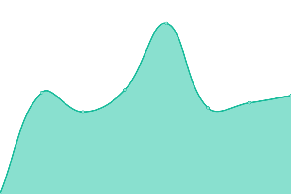 1374ms
     
 | 

<a href="https://targed.github.io/Awesome-Plugins/history/gofynd">0.00%</a>
    

|  [Gps-telecom](https://www.gps-telecom.com/.well-known/ai-plugin.json) | 🟥 Down | [gps-telecom.yml](https://github.com/targed/Awesome-Plugins/commits/HEAD/history/gps-telecom.yml) | 

 2037ms
     
 | 

<a href="https://targed.github.io/Awesome-Plugins/history/gps-telecom">0.00%</a>
    

|  [Gpt.collov](https://gpt.collov.com/.well-known/ai-plugin.json) | 🟥 Down | [gpt-collov.yml](https://github.com/targed/Awesome-Plugins/commits/HEAD/history/gpt-collov.yml) | 

 228ms
     
 | 

<a href="https://targed.github.io/Awesome-Plugins/history/gpt-collov">100.00%</a>
    

|  [GPTWeather](https://gptweather.skirano.repl.co/.well-known/ai-plugin.json) | 🟥 Down | [gpt-weather.yml](https://github.com/targed/Awesome-Plugins/commits/HEAD/history/gpt-weather.yml) | 

 0ms
     
 | 

<a href="https://targed.github.io/Awesome-Plugins/history/gpt-weather">100.00%</a>
    

|  [Greenyroad](https://www.greenyroad.com/.well-known/ai-plugin.json) | 🟥 Down | [greenyroad.yml](https://github.com/targed/Awesome-Plugins/commits/HEAD/history/greenyroad.yml) | 

 0ms
     
 | 

<a href="https://targed.github.io/Awesome-Plugins/history/greenyroad">100.00%</a>
    

|  [Ifttt_action_runs](https://ifttt.com/.well-known/ai-plugin.json) | 🟩 Up | [ifttt-action-runs.yml](https://github.com/targed/Awesome-Plugins/commits/HEAD/history/ifttt-action-runs.yml) | 

 228ms
     
 | 

<a href="https://targed.github.io/Awesome-Plugins/history/ifttt-action-runs">0.00%</a>
    

|  [Influence Marketing](https://influencermarketing.ai/.well-known/ai-plugin.json) | 🟥 Down | [influence-marketing.yml](https://github.com/targed/Awesome-Plugins/commits/HEAD/history/influence-marketing.yml) | 

 1026ms
     
 | 

<a href="https://targed.github.io/Awesome-Plugins/history/influence-marketing">0.00%</a>
    

|  [Infobot](https://infobot.ai/.well-known/ai-plugin.json) | 🟥 Down | [infobot.yml](https://github.com/targed/Awesome-Plugins/commits/HEAD/history/infobot.yml) | 

 0ms
     
 | 

<a href="https://targed.github.io/Awesome-Plugins/history/infobot">100.00%</a>
    

|  [Instacart](https://www.instacart.com/.well-known/ai-plugin.json) | 🟩 Up | [instacart.yml](https://github.com/targed/Awesome-Plugins/commits/HEAD/history/instacart.yml) | 

 254ms
     
 | 

<a href="https://targed.github.io/Awesome-Plugins/history/instacart">100.00%</a>
    

|  [Instaforex](https://instaforex.com/.well-known/ai-plugin.json) | 🟩 Up | [instaforex.yml](https://github.com/targed/Awesome-Plugins/commits/HEAD/history/instaforex.yml) | 

 892ms
     
 | 

<a href="https://targed.github.io/Awesome-Plugins/history/instaforex">0.00%</a>
    

|  [Iowa_State_University_Environmental_Mesonet](https://mesonet.agron.iastate.edu/.well-known/ai-plugin.json) | 🟩 Up | [iowa-state-university-environmental-mesonet.yml](https://github.com/targed/Awesome-Plugins/commits/HEAD/history/iowa-state-university-environmental-mesonet.yml) | 

 329ms
     
 | 

<a href="https://targed.github.io/Awesome-Plugins/history/iowa-state-university-environmental-mesonet">0.00%</a>
    

|  [Kalendar](https://kalendar.ai/.well-known/ai-plugin.json) | 🟩 Up | [kalendar.yml](https://github.com/targed/Awesome-Plugins/commits/HEAD/history/kalendar.yml) | 

 301ms
     
 | 

<a href="https://targed.github.io/Awesome-Plugins/history/kalendar">0.00%</a>
    

|  [Kassal](https://kassal.app/.well-known/ai-plugin.json) | 🟩 Up | [kassal.yml](https://github.com/targed/Awesome-Plugins/commits/HEAD/history/kassal.yml) | 

 600ms
     
 | 

<a href="https://targed.github.io/Awesome-Plugins/history/kassal">100.00%</a>
    

|  [Kittycad](https://api.kittycad.io/.well-known/ai-plugin.json) | 🟥 Down | [kittycad.yml](https://github.com/targed/Awesome-Plugins/commits/HEAD/history/kittycad.yml) | 

 339ms
     
 | 

<a href="https://targed.github.io/Awesome-Plugins/history/kittycad">100.00%</a>
    

|  [Klarna](https://www.klarna.com/.well-known/ai-plugin.json) | 🟩 Up | [klarna.yml](https://github.com/targed/Awesome-Plugins/commits/HEAD/history/klarna.yml) | 

 301ms
     
 | 

<a href="https://targed.github.io/Awesome-Plugins/history/klarna">0.00%</a>
    

|  [Klook](https://www.klook.com/.well-known/ai-plugin.json) | 🟩 Up | [klook.yml](https://github.com/targed/Awesome-Plugins/commits/HEAD/history/klook.yml) | 

 365ms
     
 | 

<a href="https://targed.github.io/Awesome-Plugins/history/klook">0.00%</a>
    

|  [Kyuda](https://www.kyuda.io/.well-known/ai-plugin.json) | 🟩 Up | [kyuda.yml](https://github.com/targed/Awesome-Plugins/commits/HEAD/history/kyuda.yml) | 

 561ms
     
 | 

<a href="https://targed.github.io/Awesome-Plugins/history/kyuda">0.00%</a>
    

|  [Laft](https://fdvbygg.no/.well-known/ai-plugin.json) | 🟩 Up | [laft.yml](https://github.com/targed/Awesome-Plugins/commits/HEAD/history/laft.yml) | 

 794ms
     
 | 

<a href="https://targed.github.io/Awesome-Plugins/history/laft">0.00%</a>
    

|  [Lighthouse](https://lighthouse.app/.well-known/ai-plugin.json) | 🟩 Up | [lighthouse.yml](https://github.com/targed/Awesome-Plugins/commits/HEAD/history/lighthouse.yml) | 

 352ms
     
 | 

<a href="https://targed.github.io/Awesome-Plugins/history/lighthouse">100.00%</a>
    

|  [Listennotes](https://ai.listennotes.com/.well-known/ai-plugin.json) | 🟩 Up | [listennotes.yml](https://github.com/targed/Awesome-Plugins/commits/HEAD/history/listennotes.yml) | 

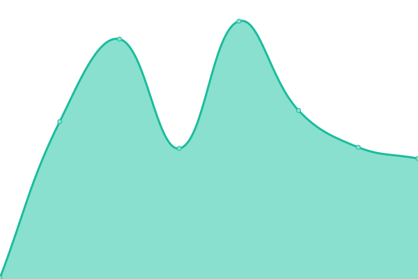 212ms
     
 | 

<a href="https://targed.github.io/Awesome-Plugins/history/listennotes">100.00%</a>
    

|  [Luma](https://lu.ma/.well-known/ai-plugin.json) | 🟩 Up | [luma.yml](https://github.com/targed/Awesome-Plugins/commits/HEAD/history/luma.yml) | 

 408ms
     
 | 

<a href="https://targed.github.io/Awesome-Plugins/history/luma">0.00%</a>
    

|  [Magicslides](https://www.magicslides.app/.well-known/ai-plugin.json) | 🟩 Up | [magicslides.yml](https://github.com/targed/Awesome-Plugins/commits/HEAD/history/magicslides.yml) | 

 185ms
     
 | 

<a href="https://targed.github.io/Awesome-Plugins/history/magicslides">100.00%</a>
    

|  [Medium](https://medium.com/.well-known/ai-plugin.json) | 🟩 Up | [medium.yml](https://github.com/targed/Awesome-Plugins/commits/HEAD/history/medium.yml) | 

 367ms
     
 | 

<a href="https://targed.github.io/Awesome-Plugins/history/medium">0.00%</a>
    

|  [Meitre](https://meitre.com/.well-known/ai-plugin.json) | 🟩 Up | [meitre.yml](https://github.com/targed/Awesome-Plugins/commits/HEAD/history/meitre.yml) | 

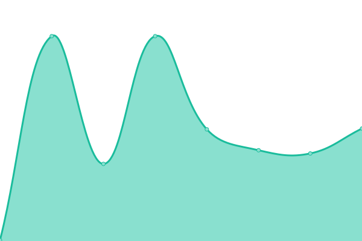 193ms
     
 | 

<a href="https://targed.github.io/Awesome-Plugins/history/meitre">100.00%</a>
    

|  [Messagebird](https://www.messagebird.com/.well-known/ai-plugin.json) | 🟩 Up | [messagebird.yml](https://github.com/targed/Awesome-Plugins/commits/HEAD/history/messagebird.yml) | 

 453ms
     
 | 

<a href="https://targed.github.io/Awesome-Plugins/history/messagebird">100.00%</a>
    

|  [Milo](https://www.joinmilo.com/.well-known/ai-plugin.json) | 🟩 Up | [milo.yml](https://github.com/targed/Awesome-Plugins/commits/HEAD/history/milo.yml) | 

 221ms
     
 | 

<a href="https://targed.github.io/Awesome-Plugins/history/milo">100.00%</a>
    

|  [Mixerbox](https://www.mixerbox.com/.well-known/ai-plugin.json) | 🟩 Up | [mixerbox.yml](https://github.com/targed/Awesome-Plugins/commits/HEAD/history/mixerbox.yml) | 

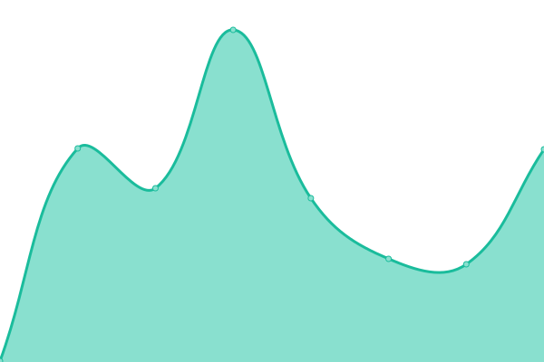 180ms
     
 | 

<a href="https://targed.github.io/Awesome-Plugins/history/mixerbox">100.00%</a>
    

|  [Monitup](https://www.monitup.com/.well-known/ai-plugin.json) | 🟥 Down | [monitup.yml](https://github.com/targed/Awesome-Plugins/commits/HEAD/history/monitup.yml) | 

 837ms
     
 | 

<a href="https://targed.github.io/Awesome-Plugins/history/monitup">100.00%</a>
    

|  [Mrkter](https://mrkter.io/.well-known/ai-plugin.json) | 🟩 Up | [mrkter.yml](https://github.com/targed/Awesome-Plugins/commits/HEAD/history/mrkter.yml) | 

 681ms
     
 | 

<a href="https://targed.github.io/Awesome-Plugins/history/mrkter">0.00%</a>
    

|  [Nftlinkroundup](https://nftlinkroundup.com/.well-known/ai-plugin.json) | 🟥 Down | [nftlinkroundup.yml](https://github.com/targed/Awesome-Plugins/commits/HEAD/history/nftlinkroundup.yml) | 

 0ms
     
 | 

<a href="https://targed.github.io/Awesome-Plugins/history/nftlinkroundup">100.00%</a>
    

|  [Oneword](https://oneword.domains/.well-known/ai-plugin.json) | 🟩 Up | [oneword.yml](https://github.com/targed/Awesome-Plugins/commits/HEAD/history/oneword.yml) | 

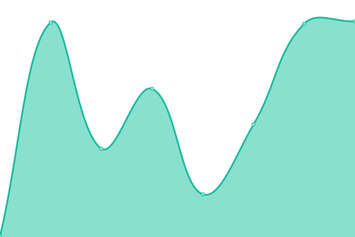 262ms
     
 | 

<a href="https://targed.github.io/Awesome-Plugins/history/oneword">100.00%</a>
    

|  [OfferZen](https://www.offerzen.com/.well-known/ai-plugin.json) | 🟥 Down | [offer-zen.yml](https://github.com/targed/Awesome-Plugins/commits/HEAD/history/offer-zen.yml) | 

 648ms
     
 | 

<a href="https://targed.github.io/Awesome-Plugins/history/offer-zen">100.00%</a>
    

|  [Olomouc](https://olomouc.eu/.well-known/ai-plugin.json) | 🟩 Up | [olomouc.yml](https://github.com/targed/Awesome-Plugins/commits/HEAD/history/olomouc.yml) | 

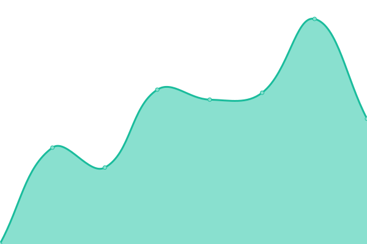 524ms
     
 | 

<a href="https://targed.github.io/Awesome-Plugins/history/olomouc">0.00%</a>
    

|  [Openarch](https://www.openarch.nl/.well-known/ai-plugin.json) | 🟩 Up | [openarch.yml](https://github.com/targed/Awesome-Plugins/commits/HEAD/history/openarch.yml) | 

 1228ms
     
 | 

<a href="https://targed.github.io/Awesome-Plugins/history/openarch">0.00%</a>
    

|  [Outscraper](https://outscraper.com/.well-known/ai-plugin.json) | 🟩 Up | [outscraper.yml](https://github.com/targed/Awesome-Plugins/commits/HEAD/history/outscraper.yml) | 

 341ms
     
 | 

<a href="https://targed.github.io/Awesome-Plugins/history/outscraper">0.00%</a>
    

|  [PageWhisperer](https://wroom.io/.well-known/ai-plugin.json) | 🟩 Up | [page-whisperer.yml](https://github.com/targed/Awesome-Plugins/commits/HEAD/history/page-whisperer.yml) | 

 385ms
     
 | 

<a href="https://targed.github.io/Awesome-Plugins/history/page-whisperer">0.00%</a>
    

|  [Pandia](https://pandia.pro/.well-known/ai-plugin.json) | 🟥 Down | [pandia.yml](https://github.com/targed/Awesome-Plugins/commits/HEAD/history/pandia.yml) | 

 692ms
     
 | 

<a href="https://targed.github.io/Awesome-Plugins/history/pandia">0.00%</a>
    

|  [Parcelsapp](https://parcelsapp.com/.well-known/ai-plugin.json) | 🟩 Up | [parcelsapp.yml](https://github.com/targed/Awesome-Plugins/commits/HEAD/history/parcelsapp.yml) | 

 559ms
     
 | 

<a href="https://targed.github.io/Awesome-Plugins/history/parcelsapp">0.00%</a>
    

|  [PEForNFTs](https://nftvaluing.com/.well-known/ai-plugin.json) | 🟥 Down | [pe-for-nf-ts.yml](https://github.com/targed/Awesome-Plugins/commits/HEAD/history/pe-for-nf-ts.yml) | 

 0ms
     
 | 

<a href="https://targed.github.io/Awesome-Plugins/history/pe-for-nf-ts">100.00%</a>
    

|  [Placid](https://placid.app/.well-known/ai-plugin.json) | 🟩 Up | [placid.yml](https://github.com/targed/Awesome-Plugins/commits/HEAD/history/placid.yml) | 

 711ms
     
 | 

<a href="https://targed.github.io/Awesome-Plugins/history/placid">100.00%</a>
    

|  [Plugin.so](https://plugin.so/.well-known/ai-plugin.json) | 🟩 Up | [plugin-so.yml](https://github.com/targed/Awesome-Plugins/commits/HEAD/history/plugin-so.yml) | 

 365ms
     
 | 

<a href="https://targed.github.io/Awesome-Plugins/history/plugin-so">0.00%</a>
    

|  [Plugsugar](https://websearch.plugsugar.com/.well-known/ai-plugin.json) | 🟥 Down | [plugsugar.yml](https://github.com/targed/Awesome-Plugins/commits/HEAD/history/plugsugar.yml) | 

 0ms
     
 | 

<a href="https://targed.github.io/Awesome-Plugins/history/plugsugar">0.00%</a>
    

|  [Polarr](https://polarr.co/.well-known/ai-plugin.json) | 🟩 Up | [polarr.yml](https://github.com/targed/Awesome-Plugins/commits/HEAD/history/polarr.yml) | 

 292ms
     
 | 

<a href="https://targed.github.io/Awesome-Plugins/history/polarr">100.00%</a>
    

|  [Polygon](https://polygon.io/.well-known/ai-plugin.json) | 🟩 Up | [polygon.yml](https://github.com/targed/Awesome-Plugins/commits/HEAD/history/polygon.yml) | 

 296ms
     
 | 

<a href="https://targed.github.io/Awesome-Plugins/history/polygon">0.00%</a>
    

|  [Portfoliopilot](https://portfoliopilot.com/.well-known/ai-plugin.json) | 🟩 Up | [portfoliopilot.yml](https://github.com/targed/Awesome-Plugins/commits/HEAD/history/portfoliopilot.yml) | 

 316ms
     
 | 

<a href="https://targed.github.io/Awesome-Plugins/history/portfoliopilot">0.00%</a>
    

|  [PortfoliosLab](https://portfolioslab.com/.well-known/ai-plugin.json) | 🟩 Up | [portfolios-lab.yml](https://github.com/targed/Awesome-Plugins/commits/HEAD/history/portfolios-lab.yml) | 

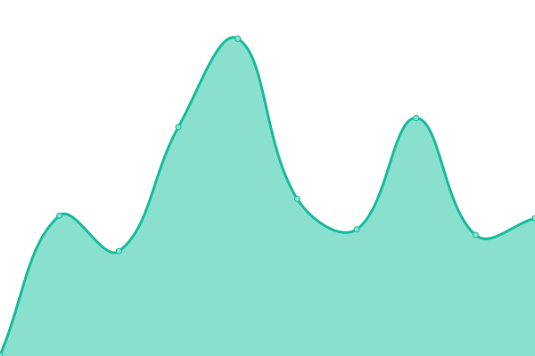 493ms
     
 | 

<a href="https://targed.github.io/Awesome-Plugins/history/portfolios-lab">0.00%</a>
    

|  [Preply](https://preply.com/.well-known/ai-plugin.json) | 🟩 Up | [preply.yml](https://github.com/targed/Awesome-Plugins/commits/HEAD/history/preply.yml) | 

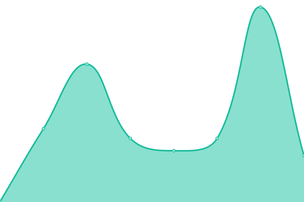 371ms
     
 | 

<a href="https://targed.github.io/Awesome-Plugins/history/preply">0.00%</a>
    

|  [Pricerunner](https://www.pricerunner.com/.well-known/ai-plugin.json) | 🟩 Up | [pricerunner.yml](https://github.com/targed/Awesome-Plugins/commits/HEAD/history/pricerunner.yml) | 

 251ms
     
 | 

<a href="https://targed.github.io/Awesome-Plugins/history/pricerunner">0.00%</a>
    

|  [Progressier](https://progressier.com/.well-known/ai-plugin.json) | 🟩 Up | [progressier.yml](https://github.com/targed/Awesome-Plugins/commits/HEAD/history/progressier.yml) | 

 953ms
     
 | 

<a href="https://targed.github.io/Awesome-Plugins/history/progressier">100.00%</a>
    

|  [Quickchart](https://quickchart.io/.well-known/ai-plugin.json) | 🟩 Up | [quickchart.yml](https://github.com/targed/Awesome-Plugins/commits/HEAD/history/quickchart.yml) | 

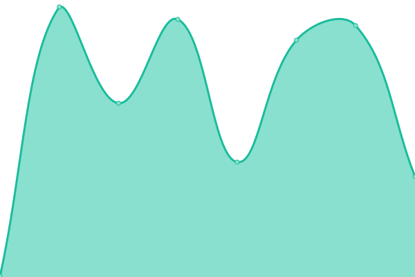 248ms
     
 | 

<a href="https://targed.github.io/Awesome-Plugins/history/quickchart">100.00%</a>
    

|  [Ramp](https://ramp.com/.well-known/ai-plugin.json) | 🟥 Down | [ramp.yml](https://github.com/targed/Awesome-Plugins/commits/HEAD/history/ramp.yml) | 

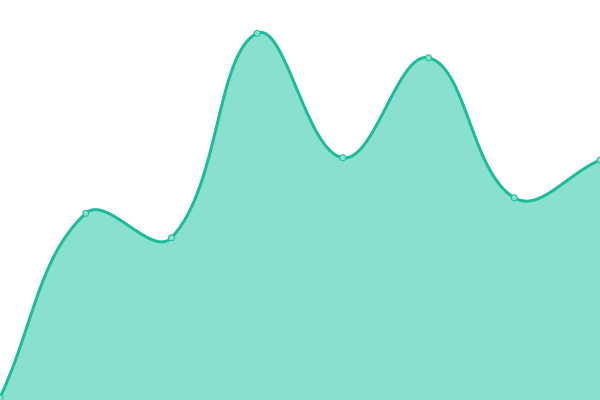 97ms
     
 | 

<a href="https://targed.github.io/Awesome-Plugins/history/ramp">100.00%</a>
    

|  [Redfin](https://www.redfin.com/.well-known/ai-plugin.json) | 🟩 Up | [redfin.yml](https://github.com/targed/Awesome-Plugins/commits/HEAD/history/redfin.yml) | 

 406ms
     
 | 

<a href="https://targed.github.io/Awesome-Plugins/history/redfin">0.00%</a>
    

|  [Reflect](https://reflect.app/.well-known/ai-plugin.json) | 🟩 Up | [reflect.yml](https://github.com/targed/Awesome-Plugins/commits/HEAD/history/reflect.yml) | 

 196ms
     
 | 

<a href="https://targed.github.io/Awesome-Plugins/history/reflect">100.00%</a>
    

|  [Remoteambition](https://remoteambition.com/.well-known/ai-plugin.json) | 🟩 Up | [remoteambition.yml](https://github.com/targed/Awesome-Plugins/commits/HEAD/history/remoteambition.yml) | 

 123ms
     
 | 

<a href="https://targed.github.io/Awesome-Plugins/history/remoteambition">100.00%</a>
    

|  [Rentable](https://www.rentable.co/.well-known/ai-plugin.json) | 🟩 Up | [rentable.yml](https://github.com/targed/Awesome-Plugins/commits/HEAD/history/rentable.yml) | 

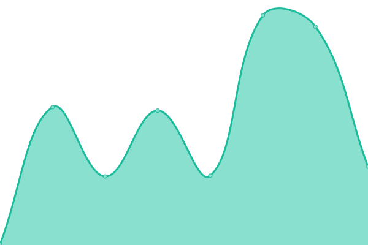 235ms
     
 | 

<a href="https://targed.github.io/Awesome-Plugins/history/rentable">100.00%</a>
    

|  [Rescuetime](https://rescuetime.com/.well-known/ai-plugin.json) | 🟩 Up | [rescuetime.yml](https://github.com/targed/Awesome-Plugins/commits/HEAD/history/rescuetime.yml) | 

 610ms
     
 | 

<a href="https://targed.github.io/Awesome-Plugins/history/rescuetime">0.00%</a>
    

|  [Savvytrader](https://savvytrader.com/.well-known/ai-plugin.json) | 🟩 Up | [savvytrader.yml](https://github.com/targed/Awesome-Plugins/commits/HEAD/history/savvytrader.yml) | 

 538ms
     
 | 

<a href="https://targed.github.io/Awesome-Plugins/history/savvytrader">100.00%</a>
    

|  [Scenex](https://scenex.jina.ai/.well-known/ai-plugin.json) | 🟩 Up | [scenex.yml](https://github.com/targed/Awesome-Plugins/commits/HEAD/history/scenex.yml) | 

 248ms
     
 | 

<a href="https://targed.github.io/Awesome-Plugins/history/scenex">100.00%</a>
    

|  [SchoolDigger](https://www.schooldigger.com/.well-known/ai-plugin.json) | 🟩 Up | [school-digger.yml](https://github.com/targed/Awesome-Plugins/commits/HEAD/history/school-digger.yml) | 

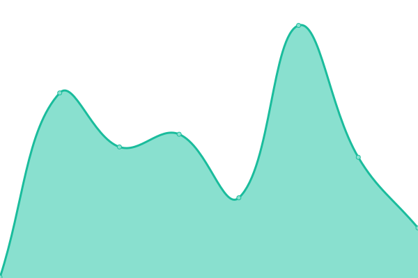 210ms
     
 | 

<a href="https://targed.github.io/Awesome-Plugins/history/school-digger">0.00%</a>
    

|  [Screenshotone](https://screenshotone.com/.well-known/ai-plugin.json) | 🟥 Down | [screenshotone.yml](https://github.com/targed/Awesome-Plugins/commits/HEAD/history/screenshotone.yml) | 

 242ms
     
 | 

<a href="https://targed.github.io/Awesome-Plugins/history/screenshotone">100.00%</a>
    

|  [Semgrep](https://semgrep.dev/.well-known/ai-plugin.json) | 🟩 Up | [semgrep.yml](https://github.com/targed/Awesome-Plugins/commits/HEAD/history/semgrep.yml) | 

 252ms
     
 | 

<a href="https://targed.github.io/Awesome-Plugins/history/semgrep">100.00%</a>
    

|  [Shop](https://shop.app/.well-known/ai-plugin.json) | 🟥 Down | [shop.yml](https://github.com/targed/Awesome-Plugins/commits/HEAD/history/shop.yml) | 

 273ms
     
 | 

<a href="https://targed.github.io/Awesome-Plugins/history/shop">100.00%</a>
    

|  [SimplyCodes](https://simplycodes.com/.well-known/ai-plugin.json) | 🟩 Up | [simply-codes.yml](https://github.com/targed/Awesome-Plugins/commits/HEAD/history/simply-codes.yml) | 

 189ms
     
 | 

<a href="https://targed.github.io/Awesome-Plugins/history/simply-codes">0.00%</a>
    

|  [Slack](https://slack.com/.well-known/ai-plugin.json) | 🟩 Up | [slack.yml](https://github.com/targed/Awesome-Plugins/commits/HEAD/history/slack.yml) | 

 150ms
     
 | 

<a href="https://targed.github.io/Awesome-Plugins/history/slack">100.00%</a>
    

|  [Stepstone](https://www.stepstone.de/.well-known/ai-plugin.json) | 🟥 Down | [stepstone.yml](https://github.com/targed/Awesome-Plugins/commits/HEAD/history/stepstone.yml) | 

 486ms
     
 | 

<a href="https://targed.github.io/Awesome-Plugins/history/stepstone">100.00%</a>
    

|  [Stonks](https://stonks.news/.well-known/ai-plugin.json) | 🟥 Down | [stonks.yml](https://github.com/targed/Awesome-Plugins/commits/HEAD/history/stonks.yml) | 

 0ms
     
 | 

<a href="https://targed.github.io/Awesome-Plugins/history/stonks">100.00%</a>
    

|  [Storeya](https://www.storeya.com/.well-known/ai-plugin.json) | 🟩 Up | [storeya.yml](https://github.com/targed/Awesome-Plugins/commits/HEAD/history/storeya.yml) | 

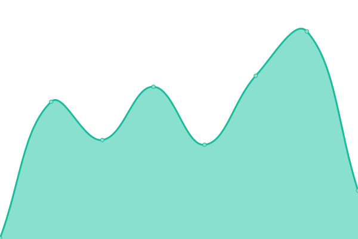 218ms
     
 | 

<a href="https://targed.github.io/Awesome-Plugins/history/storeya">100.00%</a>
    

|  [Talkface](https://talkface.ai/.well-known/ai-plugin.json) | 🟩 Up | [talkface.yml](https://github.com/targed/Awesome-Plugins/commits/HEAD/history/talkface.yml) | 

 786ms
     
 | 

<a href="https://targed.github.io/Awesome-Plugins/history/talkface">0.00%</a>
    

|  [Tasty](https://tasty.co/.well-known/ai-plugin.json) | 🟥 Down | [tasty.yml](https://github.com/targed/Awesome-Plugins/commits/HEAD/history/tasty.yml) | 

 155ms
     
 | 

<a href="https://targed.github.io/Awesome-Plugins/history/tasty">100.00%</a>
    

|  [Techspecs](https://techspecs.io/.well-known/ai-plugin.json) | 🟥 Down | [techspecs.yml](https://github.com/targed/Awesome-Plugins/commits/HEAD/history/techspecs.yml) | 

 620ms
     
 | 

<a href="https://targed.github.io/Awesome-Plugins/history/techspecs">100.00%</a>
    

|  [Telnyx](https://telnyx.com/.well-known/ai-plugin.json) | 🟩 Up | [telnyx.yml](https://github.com/targed/Awesome-Plugins/commits/HEAD/history/telnyx.yml) | 

 359ms
     
 | 

<a href="https://targed.github.io/Awesome-Plugins/history/telnyx">100.00%</a>
    

|  [Textbelt](https://textbelt.com/.well-known/ai-plugin.json) | 🟩 Up | [textbelt.yml](https://github.com/targed/Awesome-Plugins/commits/HEAD/history/textbelt.yml) | 

 301ms
     
 | 

<a href="https://targed.github.io/Awesome-Plugins/history/textbelt">0.00%</a>
    

|  [Theansible](https://www.theansible.com/.well-known/ai-plugin.json) | 🟥 Down | [theansible.yml](https://github.com/targed/Awesome-Plugins/commits/HEAD/history/theansible.yml) | 

 0ms
     
 | 

<a href="https://targed.github.io/Awesome-Plugins/history/theansible">100.00%</a>
    

|  [TickTick](https://ticktick.com/.well-known/ai-plugin.json) | 🟩 Up | [tick-tick.yml](https://github.com/targed/Awesome-Plugins/commits/HEAD/history/tick-tick.yml) | 

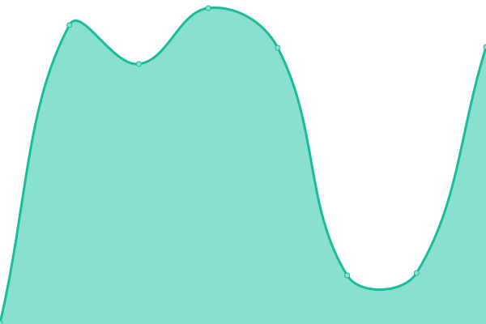 253ms
     
 | 

<a href="https://targed.github.io/Awesome-Plugins/history/tick-tick">100.00%</a>
    

|  [Tilnote](https://tilnote.io/.well-known/ai-plugin.json) | 🟩 Up | [tilnote.yml](https://github.com/targed/Awesome-Plugins/commits/HEAD/history/tilnote.yml) | 

 637ms
     
 | 

<a href="https://targed.github.io/Awesome-Plugins/history/tilnote">0.00%</a>
    

|  [Toggle](https://www.junkdoctorsnj.com/.well-known/ai-plugin.json) | 🟩 Up | [toggle.yml](https://github.com/targed/Awesome-Plugins/commits/HEAD/history/toggle.yml) | 

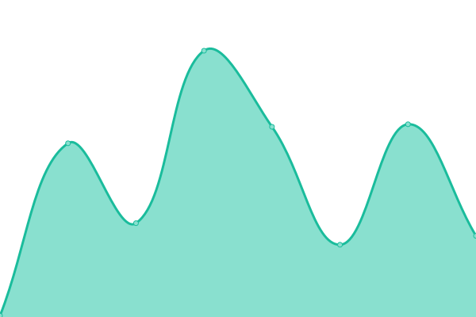 170ms
     
 | 

<a href="https://targed.github.io/Awesome-Plugins/history/toggle">0.00%</a>
    

|  [Transvribe](https://www.transvribe.com/.well-known/ai-plugin.json) | 🟩 Up | [transvribe.yml](https://github.com/targed/Awesome-Plugins/commits/HEAD/history/transvribe.yml) | 

 194ms
     
 | 

<a href="https://targed.github.io/Awesome-Plugins/history/transvribe">0.00%</a>
    

|  [Travelmyth](https://www.travelmyth.com/.well-known/ai-plugin.json) | 🟩 Up | [travelmyth.yml](https://github.com/targed/Awesome-Plugins/commits/HEAD/history/travelmyth.yml) | 

 197ms
     
 | 

<a href="https://targed.github.io/Awesome-Plugins/history/travelmyth">0.00%</a>
    

|  [Trendeer](https://www.trendeer.com/.well-known/ai-plugin.json) | 🟥 Down | [trendeer.yml](https://github.com/targed/Awesome-Plugins/commits/HEAD/history/trendeer.yml) | 

 1199ms
     
 | 

<a href="https://targed.github.io/Awesome-Plugins/history/trendeer">0.00%</a>
    

|  [Trip](https://www.trip.com/.well-known/ai-plugin.json) | 🟩 Up | [trip.yml](https://github.com/targed/Awesome-Plugins/commits/HEAD/history/trip.yml) | 

 843ms
     
 | 

<a href="https://targed.github.io/Awesome-Plugins/history/trip">100.00%</a>
    

|  [Triplewhale](https://www.triplewhale.com/.well-known/ai-plugin.json) | 🟥 Down | [triplewhale.yml](https://github.com/targed/Awesome-Plugins/commits/HEAD/history/triplewhale.yml) | 

 189ms
     
 | 

<a href="https://targed.github.io/Awesome-Plugins/history/triplewhale">100.00%</a>
    

|  [Twinkorea](https://twinkorea.io/.well-known/ai-plugin.json) | 🟩 Up | [twinkorea.yml](https://github.com/targed/Awesome-Plugins/commits/HEAD/history/twinkorea.yml) | 

 812ms
     
 | 

<a href="https://targed.github.io/Awesome-Plugins/history/twinkorea">100.00%</a>
    

|  [Twtdata](https://www.twtdata.com/.well-known/ai-plugin.json) | 🟩 Up | [twtdata.yml](https://github.com/targed/Awesome-Plugins/commits/HEAD/history/twtdata.yml) | 

 277ms
     
 | 

<a href="https://targed.github.io/Awesome-Plugins/history/twtdata">0.00%</a>
    

|  [Tym](https://tym.world/.well-known/ai-plugin.json) | 🟥 Down | [tym.yml](https://github.com/targed/Awesome-Plugins/commits/HEAD/history/tym.yml) | 

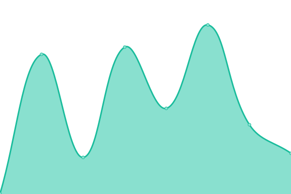 388ms
     
 | 

<a href="https://targed.github.io/Awesome-Plugins/history/tym">100.00%</a>
    

|  [Urlbox](https://urlbox.io/.well-known/ai-plugin.json) | 🟩 Up | [urlbox.yml](https://github.com/targed/Awesome-Plugins/commits/HEAD/history/urlbox.yml) | 

 409ms
     
 | 

<a href="https://targed.github.io/Awesome-Plugins/history/urlbox">0.00%</a>
    

|  [Valispace](https://www.valispace.com/.well-known/ai-plugin.json) | 🟥 Down | [valispace.yml](https://github.com/targed/Awesome-Plugins/commits/HEAD/history/valispace.yml) | 

 473ms
     
 | 

<a href="https://targed.github.io/Awesome-Plugins/history/valispace">100.00%</a>
    

|  [Vbout](https://vbout.com/.well-known/ai-plugin.json) | 🟩 Up | [vbout.yml](https://github.com/targed/Awesome-Plugins/commits/HEAD/history/vbout.yml) | 

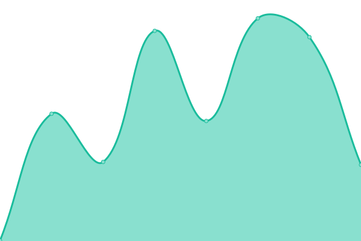 280ms
     
 | 

<a href="https://targed.github.io/Awesome-Plugins/history/vbout">0.00%</a>
    

|  [Video_highlight](https://videohighlight.com/.well-known/ai-plugin.json) | 🟩 Up | [video-highlight.yml](https://github.com/targed/Awesome-Plugins/commits/HEAD/history/video-highlight.yml) | 

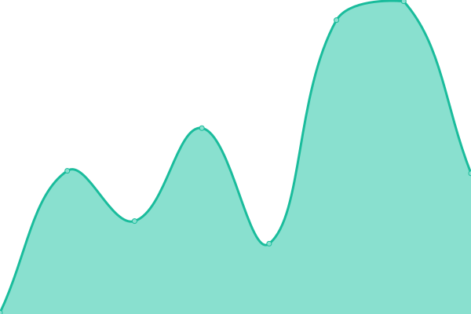 193ms
     
 | 

<a href="https://targed.github.io/Awesome-Plugins/history/video-highlight">0.00%</a>
    

|  [Vidiq](https://api.vidiq.com/.well-known/ai-plugin.json) | 🟩 Up | [vidiq.yml](https://github.com/targed/Awesome-Plugins/commits/HEAD/history/vidiq.yml) | 

 159ms
     
 | 

<a href="https://targed.github.io/Awesome-Plugins/history/vidiq">100.00%</a>
    

|  [wego](https://www.welt.de/.well-known/ai-plugin.json) | 🟩 Up | [wego.yml](https://github.com/targed/Awesome-Plugins/commits/HEAD/history/wego.yml) | 

 728ms
     
 | 

<a href="https://targed.github.io/Awesome-Plugins/history/wego">100.00%</a>
    

|  [welt_news_verse](https://www.welt.de/.well-known/ai-plugin.json) | 🟩 Up | [welt-news-verse.yml](https://github.com/targed/Awesome-Plugins/commits/HEAD/history/welt-news-verse.yml) | 

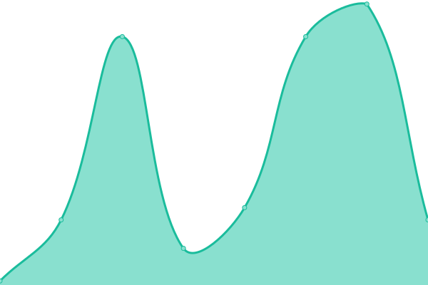 37ms
     
 | 

<a href="https://targed.github.io/Awesome-Plugins/history/welt-news-verse">100.00%</a>
    

|  [Whimsical](https://whimsical.com/api/ai-plugin) | 🟥 Down | [whimsical.yml](https://github.com/targed/Awesome-Plugins/commits/HEAD/history/whimsical.yml) | 

 268ms
     
 | 

<a href="https://targed.github.io/Awesome-Plugins/history/whimsical">100.00%</a>
    

|  [Wikiocity](https://www.wikiocity.com/.well-known/ai-plugin.json) | 🟥 Down | [wikiocity.yml](https://github.com/targed/Awesome-Plugins/commits/HEAD/history/wikiocity.yml) | 

 296ms
     
 | 

<a href="https://targed.github.io/Awesome-Plugins/history/wikiocity">100.00%</a>
    

|  [Wikipedia](https://oasst-plugins.dumbserg.al:2083/plugins/wikipedia-plugin.json) | 🟥 Down | [wikipedia.yml](https://github.com/targed/Awesome-Plugins/commits/HEAD/history/wikipedia.yml) | 

 0ms
     
 | 

<a href="https://targed.github.io/Awesome-Plugins/history/wikipedia">100.00%</a>
    

|  [WolframAlpha](https://www.wolframalpha.com/.well-known/ai-plugin.json) | 🟩 Up | [wolfram-alpha.yml](https://github.com/targed/Awesome-Plugins/commits/HEAD/history/wolfram-alpha.yml) | 

 297ms
     
 | 

<a href="https://targed.github.io/Awesome-Plugins/history/wolfram-alpha">0.00%</a>
    

|  [WolframAlphaCloud](https://www.wolframcloud.com/.well-known/ai-plugin.json) | 🟩 Up | [wolfram-alpha-cloud.yml](https://github.com/targed/Awesome-Plugins/commits/HEAD/history/wolfram-alpha-cloud.yml) | 

 1238ms
     
 | 

<a href="https://targed.github.io/Awesome-Plugins/history/wolfram-alpha-cloud">0.00%</a>
    

|  [Wordpress](https://wordpress.com/.well-known/ai-plugin.json) | 🟥 Down | [wordpress.yml](https://github.com/targed/Awesome-Plugins/commits/HEAD/history/wordpress.yml) | 

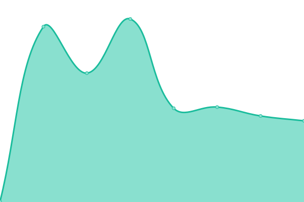 354ms
     
 | 

<a href="https://targed.github.io/Awesome-Plugins/history/wordpress">100.00%</a>
    

|  [Woxo](https://woxo.tech/.well-known/ai-plugin.json) | 🟩 Up | [woxo.yml](https://github.com/targed/Awesome-Plugins/commits/HEAD/history/woxo.yml) | 

 162ms
     
 | 

<a href="https://targed.github.io/Awesome-Plugins/history/woxo">0.00%</a>
    

|  [Yabble](https://yabblezone.net/.well-known/ai-plugin.json) | 🟥 Down | [yabble.yml](https://github.com/targed/Awesome-Plugins/commits/HEAD/history/yabble.yml) | 

 134ms
     
 | 

<a href="https://targed.github.io/Awesome-Plugins/history/yabble">100.00%</a>
    

|  [YachtSearch](https://www.denisonyachtsales.com/.well-known/ai-plugin.json) | 🟩 Up | [yacht-search.yml](https://github.com/targed/Awesome-Plugins/commits/HEAD/history/yacht-search.yml) | 

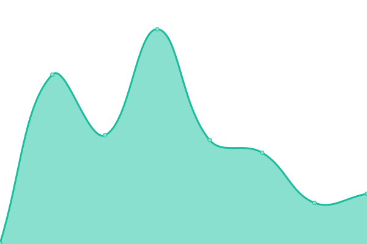 217ms
     
 | 

<a href="https://targed.github.io/Awesome-Plugins/history/yacht-search">0.00%</a>
    

|  [Yelp](https://www.yelp.com/.well-known/ai-plugin.json) | 🟥 Down | [yelp.yml](https://github.com/targed/Awesome-Plugins/commits/HEAD/history/yelp.yml) | 

 171ms
     
 | 

<a href="https://targed.github.io/Awesome-Plugins/history/yelp">100.00%</a>
    

|  [Yourtango](https://www.yourtango.com/.well-known/ai-plugin.json) | 🟥 Down | [yourtango.yml](https://github.com/targed/Awesome-Plugins/commits/HEAD/history/yourtango.yml) | 

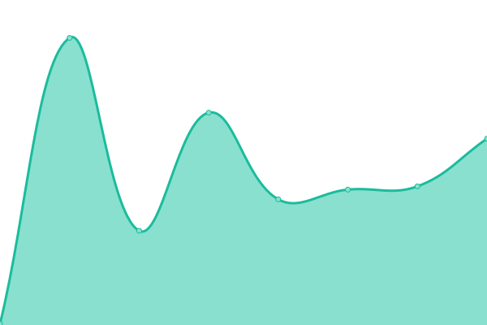 144ms
     
 | 

<a href="https://targed.github.io/Awesome-Plugins/history/yourtango">100.00%</a>
    

|  [YouTubeSummaries](https://eightify.app/.well-known/ai-plugin.json) | 🟩 Up | [you-tube-summaries.yml](https://github.com/targed/Awesome-Plugins/commits/HEAD/history/you-tube-summaries.yml) | 

 247ms
     
 | 

<a href="https://targed.github.io/Awesome-Plugins/history/you-tube-summaries">0.00%</a>
    

|  [Zapier](https://zapier.com/.well-known/ai-plugin.json) | 🟩 Up | [zapier.yml](https://github.com/targed/Awesome-Plugins/commits/HEAD/history/zapier.yml) | 

 295ms
     
 | 

<a href="https://targed.github.io/Awesome-Plugins/history/zapier">0.00%</a>
    

<!--end: status pages-->

[**Visit our status website →**](https://targed.github.io/Awesome-Plugins/)

## 📄 License

- Powered by: [Upptime](https://github.com/upptime/upptime)
- Code: [MIT](./LICENSE) © [targed](https://targed.github.io/Awesome-Plugins/)
- Data in the `./history` directory: [Open Database License](https://opendatacommons.org/licenses/odbl/1-0/)
